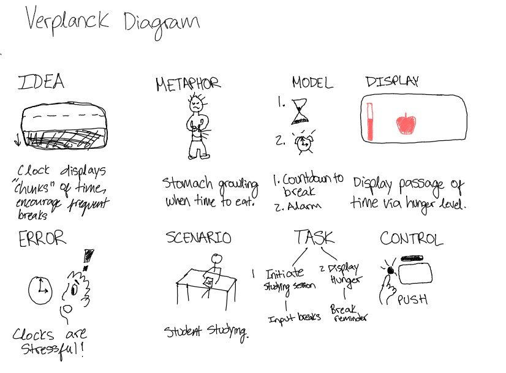
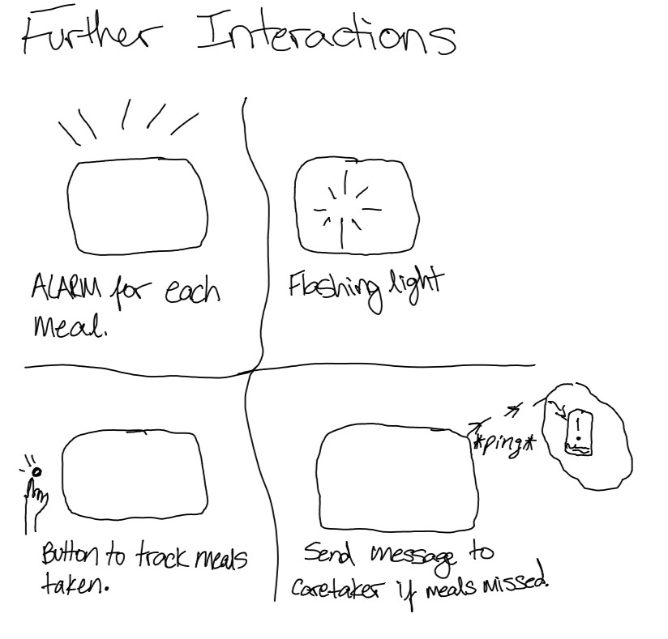
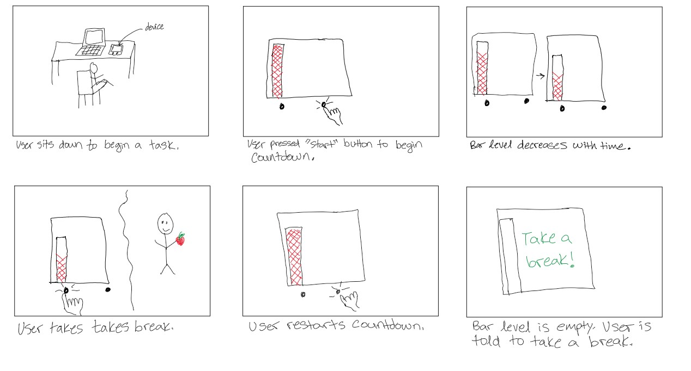

# Interactive Prototyping: The Clock of Pi
**NAMES OF COLLABORATORS HERE**

Does it feel like time is moving strangely during this semester?

For our first Pi project, we will pay homage to the [timekeeping devices of old](https://en.wikipedia.org/wiki/History_of_timekeeping_devices) by making simple clocks.

It is worth spending a little time thinking about how you mark time, and what would be useful in a clock of your own design.

**Please indicate anyone you collaborated with on this Lab here.** 

Sam Willenson and Grace Nho helped me with part D of the lab and with setting up Virtual Source Code. Additionally, they gave me feedback when ideating potential projects.

### Modify the barebones clock to make it your own

Does time have to be linear?  How do you measure a year? [In daylights? In midnights? In cups of coffee?](https://www.youtube.com/watch?v=wsj15wPpjLY)

Can you make time interactive? You can look in `screen_test.py` for examples for how to use the buttons.

Please sketch/diagram your clock idea. (Try using a [Verplank digram](http://www.billverplank.com/IxDSketchBook.pdf)!



The concept of this device is to use a measure time as the time elapsed between breaks. The display shows a bar displaying a countdown of the maximum time allowed for working. As the bar goes down from full, pictures of different food items will be displayed at various intervals. The first interval will display an apple (as seen in the diagram above.) This indicates that the user may take a "snack-size" break at that time. If the user forgoes the break and continues working, they will reach the second interval where a sandwich will be displayed. This indicates that user may take a "small-meal". If the user decides to keep working, they will reach the third interval where a roasted turkey will be displayed. The bar will also be empty at this point. This signals to the user that they must take a "meal" break before continuing their work.

One button will be used to initiate a work session. Another button is used to start and end breaks. If a break is taken before the bar is empty, the user pushes the button and the bar goes back to full.


[Copy of Code](https://github.com/jaxriemer/Interactive-Lab-Hub/blob/96c9f862c1d08e4791d3aa452051d89cb06a94ee/Lab%202/screen_prototype.py)

After you edit and work on the scripts for Lab 2, the files should be upload back to your own GitHub repo! You can push to your personal github repo by adding the files here, commiting and pushing.

```
(circuitpython) pi@ixe00:~/Interactive-Lab-Hub/Lab 2 $ git add .
(circuitpython) pi@ixe00:~/Interactive-Lab-Hub/Lab 2 $ git commit -m 'your commit message here'
(circuitpython) pi@ixe00:~/Interactive-Lab-Hub/Lab 2 $ git push
```

After that, Git will ask you to login to your GitHub account to push the updates online, you will be asked to provide your GitHub user name and password. Remember to use the "Personal Access Tokens" you set up in Part A as the password instead of your account one! Go on your GitHub repo with your laptop, you should be able to see the updated files from your Pi!


## Part F. 
## Make a short video of your modified barebones PiClock

[](https://www.youtube.com/watch?v=2r1qmZqJbys)


I made some modifications to the interaction in my Verplanck Diagram to stage the interaction in the video above. The clock shows the passage of time through different mealtimes. The idea is that our bodies, themselves, are machines that have a biological clock. By using the mealtimes as a form of time-keeping, the user is also more in-tune with their hunger.

## Part G. 
## Sketch and brainstorm further interactions and features you would like for your clock for Part 2.


# Prep for Part 2

1. Pick up remaining parts for kit on Thursday lab class. Check the updated [parts list inventory](partslist.md) and let the TA know if there is any part missing.
  

2. Look at and give feedback on the Part G. for at least 2 other people in the class (and get 2 people to comment on your Part G!)

# Lab 2 Part 2



