# Ph-UI!!!
## Deliverables \& Submission for Lab 4

The deliverables for this lab are, writings, sketches, photos, and videos that show what your prototype:
* "Looks like": shows how the device should look, feel, sit, weigh, etc.
* "Works like": shows what the device can do.
* "Acts like": shows how a person would interact with the device.
## The Report (Part 1: A-D, Part 2: E-F)

### Physical considerations for sensing

Usually, sensors need to positioned in specific locations or orientations to make them useful for their application. Now that you've tried a bunch of the sensors, pick one that you would like to use, and an application where you use the output of that sensor for an interaction. For example, you can use a distance sensor to measure someone's height if you position it overhead and get them to stand under it.

**\*\*\*Draw 5 sketches of different ways you might use your sensor, and how the larger device needs to be shaped in order to make the sensor useful.\*\*\***

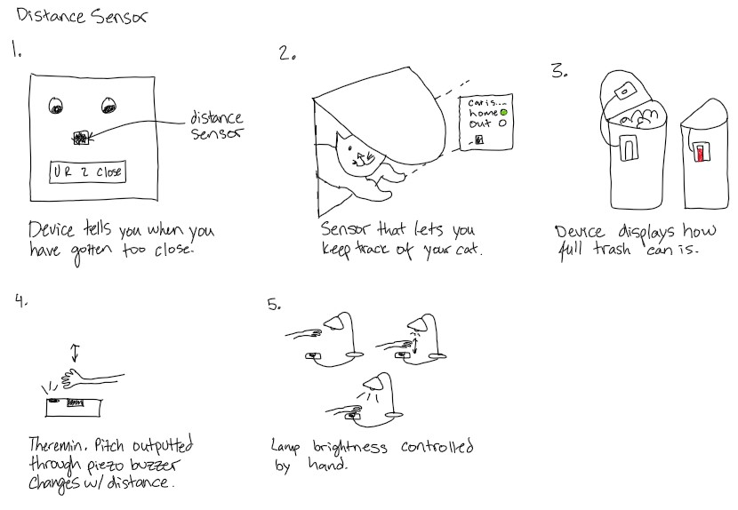


**\*\*\*What are some things these sketches raise as questions? What do you need to physically prototype to understand how to anwer those questions?\*\*\***

The sketches raise the question of the placement of the sensor to make it the most effective and also intuitive for the user. Additionally, the housing must be large enough to house the RPi.

**\*\*\*Pick one of these designs to prototype.\*\*\***

I will be further developing the concept for a brightness controller that is mapped to the distance of a hand from the top base plate. The brightness will be displayed by the oled screen.


### Part D
### Physical considerations for displaying information and housing parts

Your kit includes these [SparkFun Qwiic OLED screens](https://www.sparkfun.com/products/17153). These use less power than the MiniTFTs you have mounted on the GPIO pins of the Pi, but, more importantly, they can be more flexibily be mounted elsewhere on your physical interface. The way you program this display is almost identical to the way you program a  Pi display. Take a look at `oled_test.py` and some more of the [Adafruit examples](https://github.com/adafruit/Adafruit_CircuitPython_SSD1306/tree/master/examples).
 
**\*\*\*Sketch 5 designs for how you would physically position your display and any buttons or knobs needed to interact with it.\*\*\***


**\*\*\*What are some things these sketches raise as questions? What do you need to physically prototype to understand how to anwer those questions?\*\*\***

One question that comes up is the size of the base needed to house the Raspberry Pi. It is also important to consider how everything will connect. Additionally, access to the RPi is needed to reprogram the RPi.


**\*\*\*Pick one of these display designs to integrate into your prototype.\*\*\***

I will prototype the final sketch.


**\*\*\*Explain the rationale for the design.\*\*\*** (e.g. Does it need to be a certain size or form or need to be able to be seen from a certain distance?)

The design should map the display in a way that is intuitive for the user. By placing the OLED display vertically, it matches the vertical motion of the users hand to adjust the brightness. The recessed design of the top base plate, should ideally minimize any potential noise from unintended motion in the peripherals of the sensor. There also must be access points for connections and to remove the RasPi.

For prototyping, I will make my design larger to ensure it is compatible with my components. For future iterations, I can then optimize the size for form while knowing the layout needed to have proper connections.

Build a cardbord prototype of your design.

**\*\*\*Document your rough prototype.\*\*\***

Outline the components for the main housing of the RPi and distance sensor.

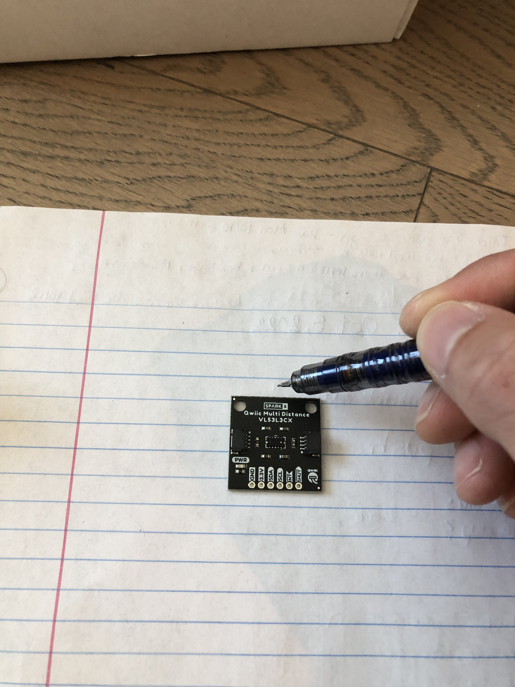
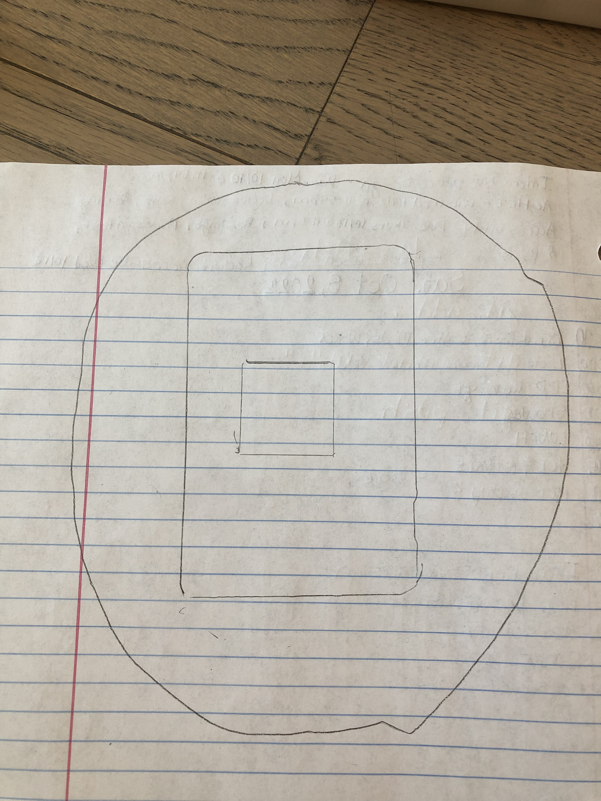


Create unwrapped sketch of housing and transfer to cardboard.

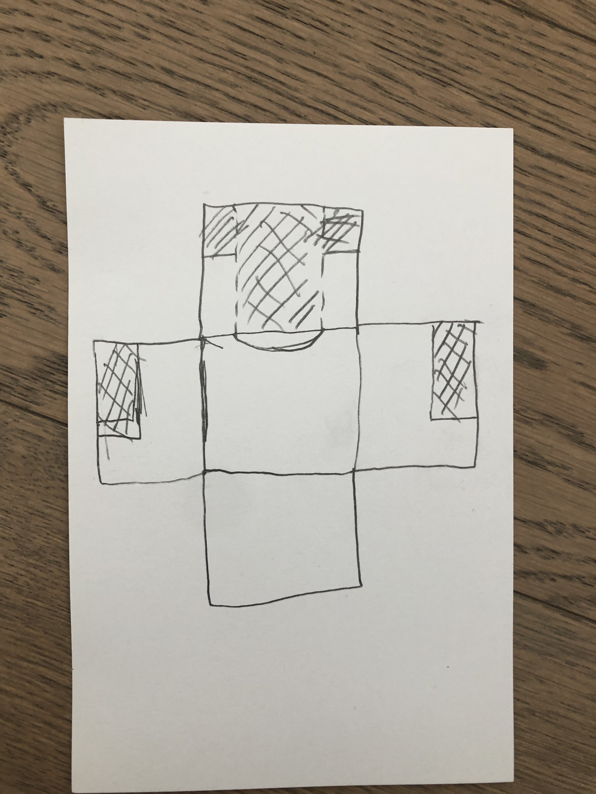


Outline circles for main housing and cut.

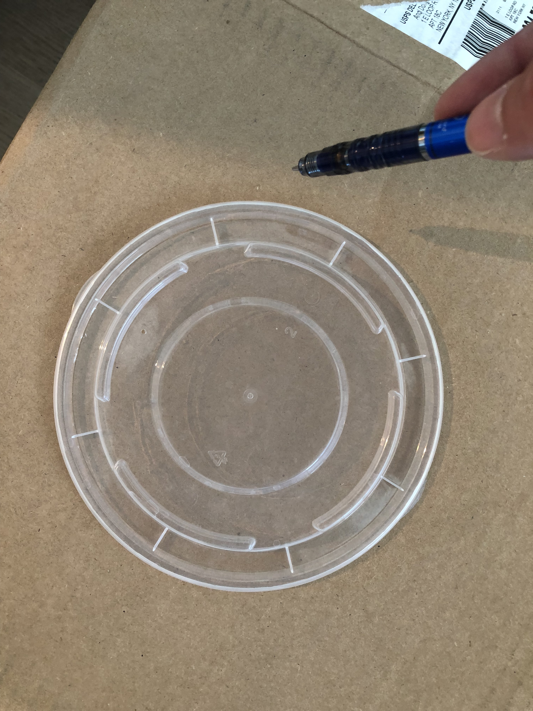


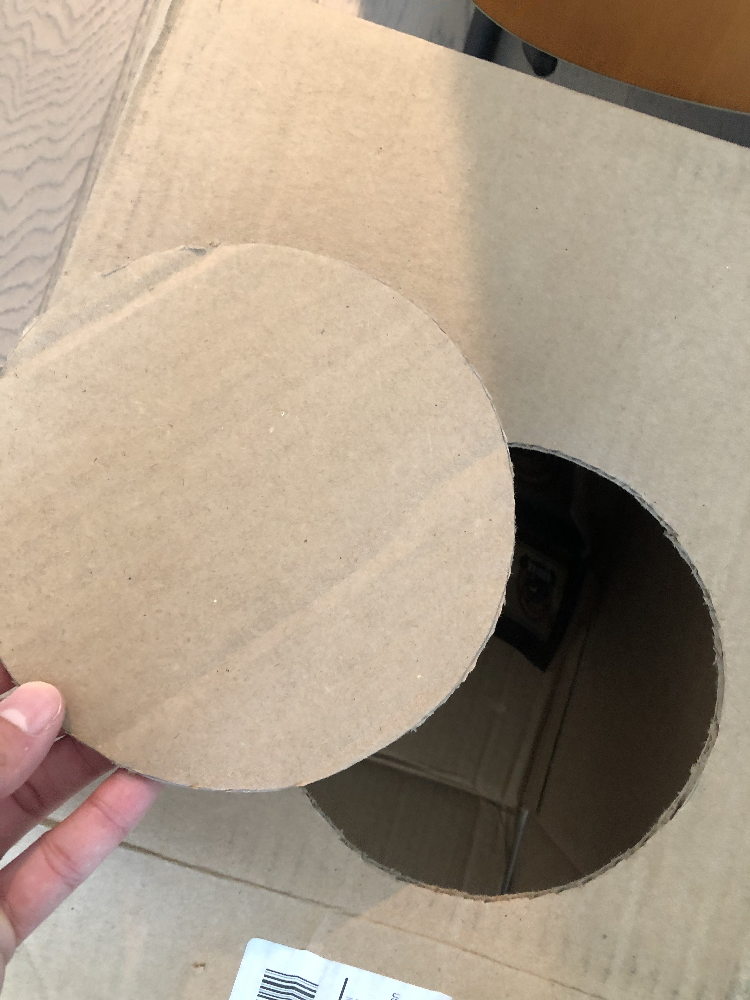


Create strip to connect top and buttom circles.


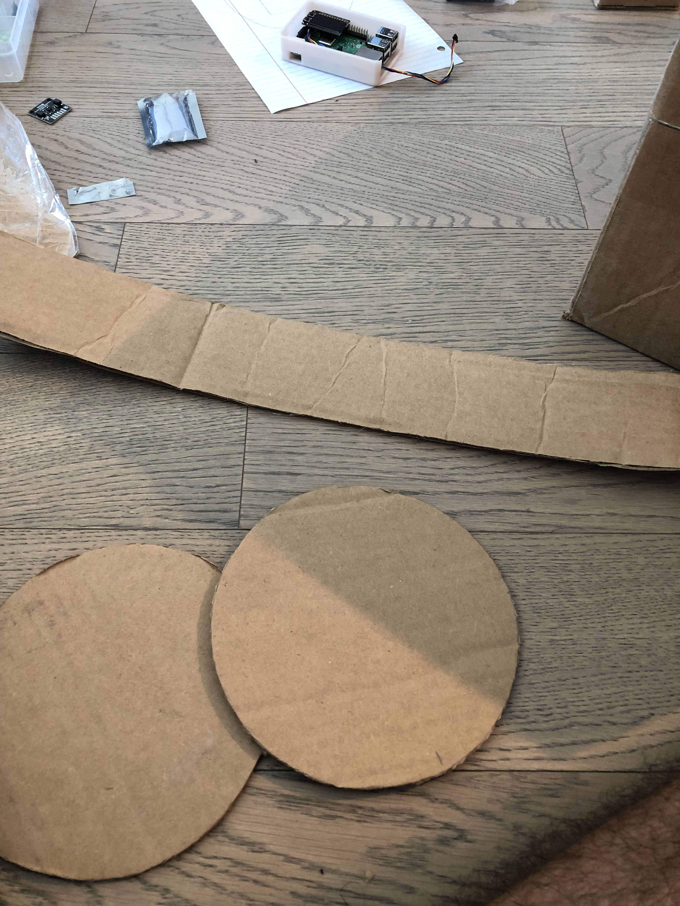


Score the top circle and connecting strip and connect.

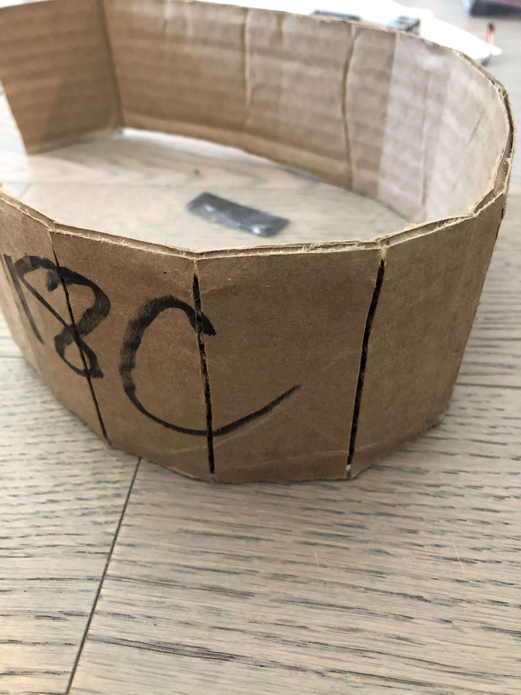

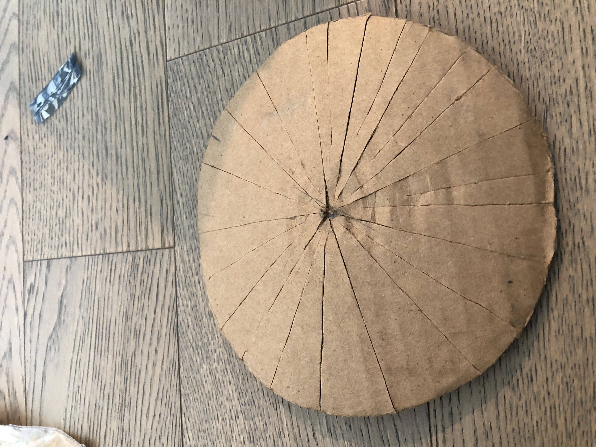

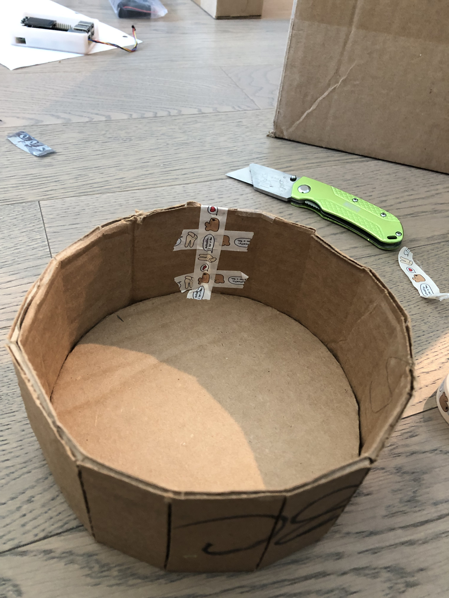


Assemble.

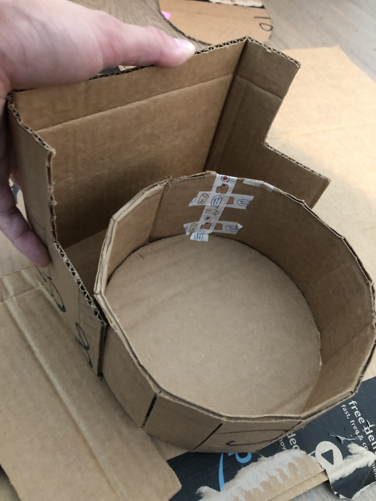

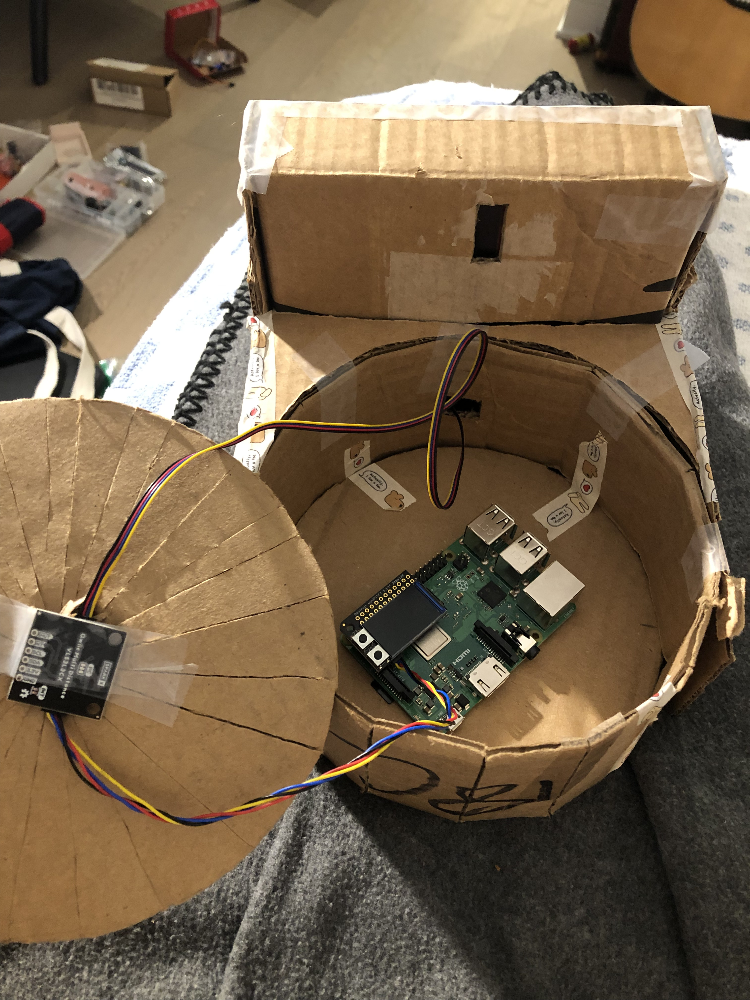

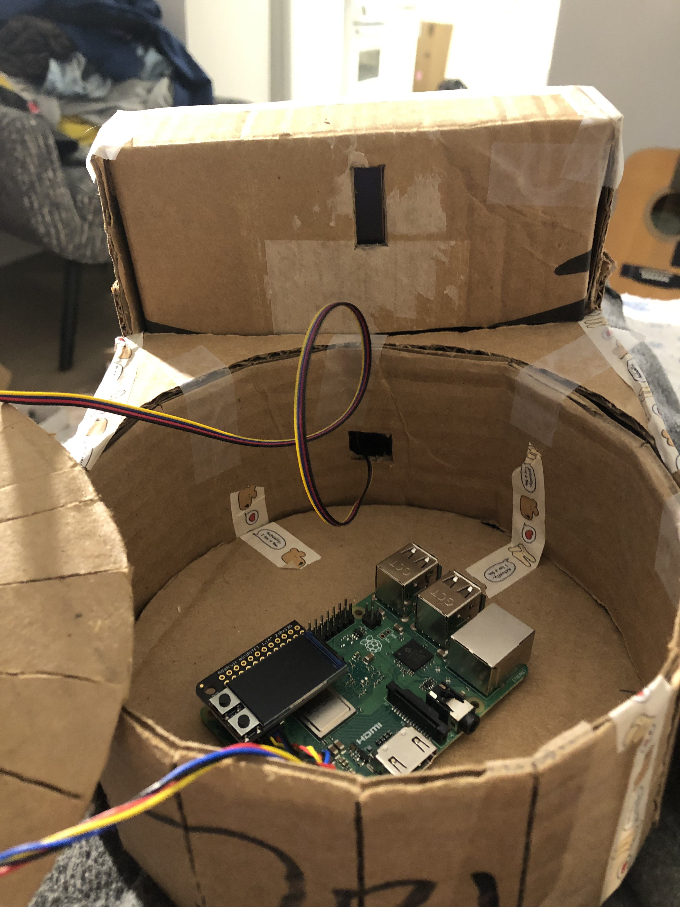


LAB PART 2

### Part 2

Following exploration and reflection from Part 1, complete the "looks like," "works like" and "acts like" prototypes for your design, reiterated below.

### Part E (Optional)
### Servo Control with Joystick

In the class kit, you should be able to find the [Qwiic Servo Controller](https://www.sparkfun.com/products/16773) and [Micro Servo Motor SG51](https://www.adafruit.com/product/2201). The Qwiic Servo Controller will need external power supply to drive, which are included in your kit. Connect the servo controller to the miniPiTFT through qwiic connector and connect the external battery to the 2-Pin JST port (ower port) on the servo controller. Connect your servo to channel 2 on the controller, make sure the brown is connected to GND and orange is connected to PWM.


In this exercise, we will be using the nice [ServoKit library](https://learn.adafruit.com/16-channel-pwm-servo-driver/python-circuitpython) developed by Adafruit! We will continue to use the `circuitpython` virtual environment we created. Activate the virtual environment and make sure to install the latest required libraries by running:

```
(circuitpython) pi@ixe00:~/Interactive-Lab-Hub/Lab 4 $ pip3 install -r requirements.txt
```

A servo motor is a rotary actuator or linear actuator that allows for precise control of angular or linear position. The position of a servo motor is set by the width of an electrical pulse, that is, we can use PWM (pulse-width modulation) to set and control the servo motor position. You can read [this](https://learn.adafruit.com/adafruit-arduino-lesson-14-servo-motors/servo-motors) to learn a bit more about how exactly a servo motor works.

Now that you have a basic idea of what a servo motor is, look into the script `qwiic_servo_example.py` we provide. In line 14, you should see that we have set up the min_pulse and max_pulse corresponding to the servo turning 0 - 180 degree. Try running the servo example code now and see what happens:

```
(circuitpython) pi@ixe00:~/Interactive-Lab-Hub/Lab 4 $ python servo_test.py
```

It is also possible to control the servo using the sensors mentioned in as in part A and part B, and/or from some of the buttons or parts included in your kit, the simplest way might be to chain Qwiic buttons to the other end of the Qwiic OLED. Like this:

<p align="center"> </p>

You can then call whichever control you like rather than setting a fixed value for the servo. For more information on controlling Qwiic devices, Sparkfun has several python examples, such as [this](https://learn.sparkfun.com/tutorials/qwiic-joystick-hookup-guide/all#python-examples).

We encourage you to try using these controls, **while** paying particular attention to how the interaction changes depending on the position of the controls. For example, if you have your servo rotating a screen (or a piece of cardboard) from one position to another, what changes about the interaction if the control is on the same side of the screen, or the opposite side of the screen? Trying and retrying different configurations generally helps reveal what a design choice changes about the interaction -- _make sure to document what you tried_!

### Part F
### Record

Document all the prototypes and iterations you have designed and worked on! Again, deliverables for this lab are writings, sketches, photos, and videos that show what your prototype:
* "Looks like": shows how the device should look, feel, sit, weigh, etc.
* "Works like": shows what the device can do
* "Acts like": shows how a person would interact with the device

